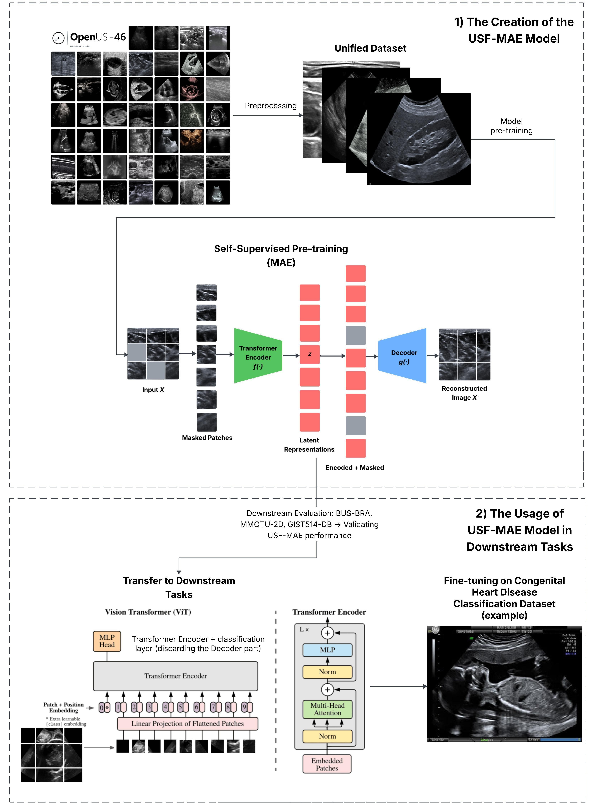

# 🩺 USF-MAE: Ultrasound Self-Supervised Foundation Model with Masked Autoencoding

This repository accompanies the paper:

> **Paper Title: USF-MAE: Ultrasound Self-Supervised Foundation Model with Masked Autoencoding**  
> Authors: *Youssef Megahed, Robin Ducharme, Aylin Erman, Mark Walker, Steven Hawken, Adrian D.C. Chan*  

[](https://doi.org/10.48550/arXiv.2510.22990)

---



## 🧠 Overview

**USF-MAE** is the first large-scale, self-supervised MAE foundation model trained exclusively on ultrasound (US) data.  
The model leverages a **Vision Transformer (ViT)**–based masked autoencoder (MAE) architecture to learn rich, modality-specific representations directly from unlabeled ultrasound scans.

USF-MAE was pretrained on **370,000 2D and 3D ultrasound images** curated from **46 open-source datasets**, collectively named **OpenUS-46**.  
This repository provides:
- The **USF-MAE pretrained checkpoint** ([Checkpoints section](#-checkpoints))
- Access links and references for **OpenUS-46** ([OpenUS-46 Dataset Collection section](#-openus-46-dataset-collection)) - Additional three datasets (a total of 49D "**OpenUS-49**") can be accessed using the following link: [Link](https://drive.google.com/file/d/1TJ6Rz2MGtfUzGrK-LPO6DSETIV8fpQXh/view?usp=drive_link)
- Scripts for USF-MAE pretraining
- Access the Facebook MAE scripts using the following link: [Link](https://drive.google.com/file/d/1fYLrKOI-hvFFnY_gA8U6JvH2YziEvgr8/view?usp=drive_link)

---

## 📦 Model Highlights

- **Architecture:** Vision Transformer (ViT) encoder–decoder MAE  
- **Pretraining strategy:** Self-supervised masked patch reconstruction  
- **Pretraining data:** 360K unlabeled ultrasound images from 43 datasets (10k from 3 datasets were used in evaluation)  
- **Downstream tasks:**  
  - Breast cancer classification (BUS-BRA)  
  - Ovarian tumor subtype classification (MMOTU-2D)  
  - Gastrointestinal stromal tumor detection (GIST514-DB)  
- **Key results:**  
  - F1-scores of 81.6 %, 79.6 %, and 82.4 % on the above tasks  
  - Outperformed CNN and ViT baselines  
  - Comparable to the supervised UltraSam model on BUS-BRA and outperformed it on the MMOTU-2D and GIST514-DB datasets while using no labels

---

## 🌍 OpenUS-46 Dataset Collection

**OpenUS-46** is a large, unified compilation of 46 publicly available ultrasound datasets from multiple anatomical regions and clinical tasks.  
All datasets remain under their original licenses. We provide direct access links for research reproducibility and transparency.

| Dataset Name | Anatomy / Target Region | Access Link |
|---------------|------------------------|--------------|
| 105US (1) | Liver | [Link](https://www.researchgate.net/publication/329586355_100_2D_US_Images_and_Tumor_Segmentation_Masks) |
| AbdomenUS (2) | Abdomen | [Link](https://www.kaggle.com/datasets/ignaciorlando/ussimandsegm?resource=download) |
| ACOUSLIC (3) | Abdomen | [Link](https://zenodo.org/records/12697994) |
| AUL (4) | Liver | [Link](https://zenodo.org/records/7272660) |
| BLUES (5) | Lung | [Link](https://github.com/NinaWie/COVID-BLUES) |
| BP (6) | Neck | [Link](https://www.kaggle.com/competitions/ultrasound-nerve-segmentation/data?select=train) |
| Brachial Plexus (7) | Neck | [Link](https://github.com/Regional-US/brachial_plexus) |
| BrEaST (8) | Breast | [Link](https://www.cancerimagingarchive.net/collection/breast-lesions-usg/) |
| BUS (Dataset B) (9) | Breast | [Link](https://helward.mmu.ac.uk/STAFF/M.Yap/dataset.php) |
| BUS_UC (10) | Breast | [Link](https://data.mendeley.com/datasets/3ksd7w7jkx/1) |
| BUS_UCML (11) | Breast | [Link](https://data.mendeley.com/datasets/7fvgj4jsp7/1) |
| BUS-BRA (12) | Breast | [Link](https://zenodo.org/records/8231412) |
| Cactus Dataset (13) | Heart | [Link](https://users.encs.concordia.ca/~kadem/cactus/#:~:text=Dataset%20Link%3A%20Download%20the%20CACTUS,database) |
| CAMUS_public (14) | Echocardiography | [Link](https://humanheart-project.creatis.insa-lyon.fr/database/#collection/6373703d73e9f0047faa1bc8) |
| CardiacUDC (15) | Heart | [Link](https://www.kaggle.com/datasets/xiaoweixumedicalai/cardiacudc-dataset?select=cardiacUDC_dataset.z06) |
| CCAUI (16) | Common Carotid Artery | [Link](https://data.mendeley.com/datasets/d4xt63mgjm/1) |
| DFHI (17) | Fetal Head | [Link](https://zenodo.org/records/8265464) |
| EchoCP (18) | Heart | [Link](https://www.kaggle.com/datasets/xiaoweixumedicalai/echocp) |
| EchoNet-Dynamic (19) | Heart | [Link](https://echonet.github.io/dynamic/) |
| EchoNet-Pediatric (20) | Heart | [Link](https://echonet.github.io/pediatric/index.html#dataset) |
| FALLMUD (21) | Leg Muscle | [Link](https://kalisteo.cea.fr/index.php/fallmud/#) |
| FASS (22) | Fetal Abdominal | [Link](https://data.mendeley.com/datasets/4gcpm9dsc3/1) |
| Fast-U-Net (23) | Fetal Abdominal | [Link](https://github.com/vahidashkani/Fast-U-Net/tree/main) |
| FEFT (24) | Fetal Echocardiography | [Link](https://figshare.com/articles/figure/First_Trimester_Fetal_Echocardiography_Data_Set_for_Classification/21215492?file=37624184) |
| FETAL_PLANES_DB (25) | Fetal Anatomy | [Link](https://zenodo.org/records/3904280) |
| FH-PS-AOP (26) | Fetal Head | [Link](https://zenodo.org/records/7851339) |
| GIST514-DB (27) | Gastrointestinal | [Link](https://drive.google.com/drive/folders/1TG9Bq-OaKkMXV2s42f_oZJdoTOfIAZLi) |
| HC (28) | Fetal Head Circumference | [Link](https://zenodo.org/records/1327317) |
| JNU-IFM (29) | Pelvis and Fetal Head | [Link](https://figshare.com/articles/dataset/JNU-IFM/14371652) |
| kidneyUS (30) | Kidney | [Link](https://github.com/rsingla92/kidneyUS) |
| LUSS_phantom (31) | Lung | [Link](https://archive.researchdata.leeds.ac.uk/1263/) |
| MicroSeg (32) | Prostate | [Link](https://zenodo.org/records/10475293) |
| MMOTU-2D (33) | Ovarian Tumor | [Link](https://drive.google.com/drive/folders/1c5n0fVKrM9-SZE1kacTXPt1pt844iAs1) |
| MMOTU-3D (34) | Ovarian Tumor | [Link](https://drive.google.com/drive/folders/1c5n0fVKrM9-SZE1kacTXPt1pt844iAs1) |
| Pocus (35) | Lung | [Link](https://github.com/jannisborn/covid19_ultrasound) |
| Porcine (36) | Spinal Cord | [Link](https://github.com/HEPIUSLAB/ultrasound_spinal_cord_dataset) |
| PSFHS (37) | Pelvis and Fetal Head | [Link](https://zenodo.org/records/10969427) |
| regPro (38) | Prostate | [Link](https://zenodo.org/records/8004388) |
| S1 (39) | Breast | [Link](https://pmc.ncbi.nlm.nih.gov/articles/PMC8205136/) |
| Segthy (40) | Thyroid and Neck | [Link](https://www.cs.cit.tum.de/camp/publications/segthy-dataset/) |
| STMUS_NDA (41) | Musculoskeletal | [Link](https://data.mendeley.com/datasets/3jykz7wz8d/1) |
| STU-Hospital (42) | N/A | [Link](https://github.com/xbhlk/STU-Hospital/tree/master) |
| Thyroid Dataset (43) | Head and Neck | [Link](https://github.com/haifangong/TRFE-Net-for-thyroid-nodule-segmentation/tree/main) |
| Thyroid US Cineclip (44) | Thyroid | [Link](https://stanfordaimi.azurewebsites.net/datasets/a72f2b02-7b53-4c5d-963c-d7253220bfd5) |
| Ultrasound Fetus Dataset (45) | Fetal | [Link](https://www.kaggle.com/datasets/orvile/ultrasound-fetus-dataset?select=Ultrasound+Fetus+Dataset) |
| UPBD (46) | Brachial Plexus | [Link](https://ubpd.worldwidetracing.com:9443/) |

> 📘 *Note:* All datasets retain their original licenses and should be cited appropriately.

---

## 🧩 Checkpoints

| Model | Pretraining Data | Epochs | Download |
|--------|------------------|---------|-----------|
| **USF-MAE (100 epochs - recommended)** | OpenUS-46 (370K images) | 100 | [Download](https://drive.google.com/file/d/1ZPu_7KhMEuaq-XdLhVp2EEgMgLJ4dKhr/view?usp=drive_link) |
| **USF-MAE (500 epochs)** | OpenUS-46 (370K images) | 500 | [Download](https://drive.google.com/file/d/15n71qHXSBjEjrLtCOzvBb6gTsGhh7NUg/view?usp=drive_link) |

---

## 🧪 Usage

```bash
# Clone repository
git clone https://github.com/Yusufii9/USF-MAE.git
cd USF-MAE
```

## 📚 References

If you find our work helpful for your research, please consider citing us using the following BibTeX entry:

```bibtex
@article{megahed2025usfmae,
  title={USF-MAE: Ultrasound Self-Supervised Foundation Model with Masked Autoencoding},
  author={Youssef Megahed and Robin Ducharme and Aylin Erman and Mark Walker and Steven Hawken and Adrian D. C. Chan},
  year={2025},
  eprint={2510.22990v2},
  archivePrefix={arXiv},
  primaryClass={eess.IV},
  url={https://doi.org/10.48550/arXiv.2510.22990},
}
```

